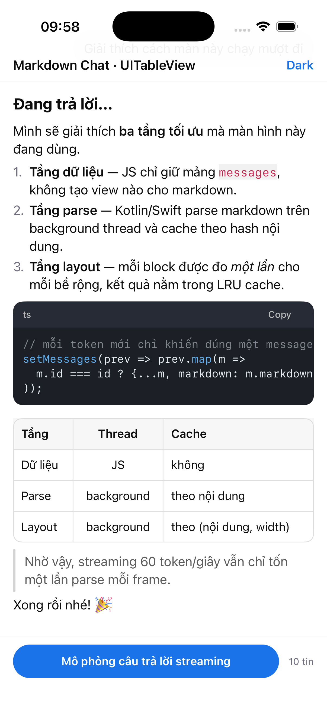
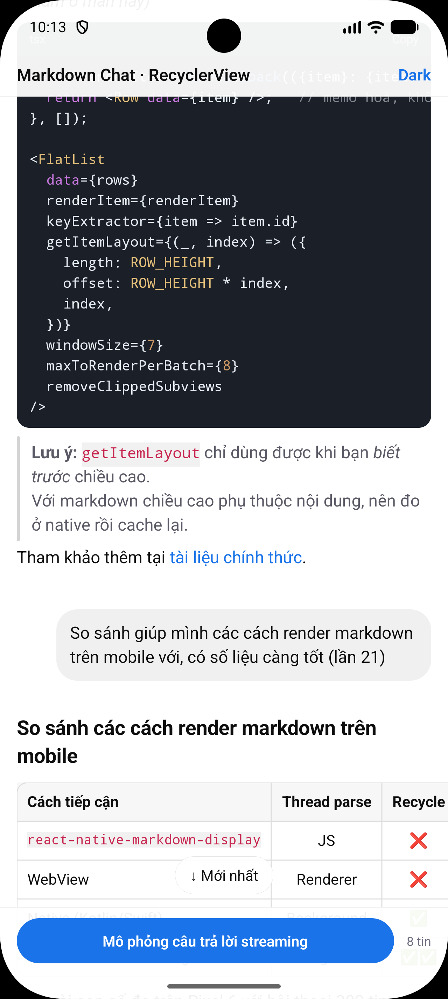

# react-native-md-list

List markdown kiểu ChatGPT / Gemini, render **hoàn toàn bằng native**
(Kotlin + RecyclerView trên Android, Swift + UITableView trên iOS), gọi từ React Native
qua Fabric (New Architecture).

| iOS (UITableView) | Android (RecyclerView) |
| --- | --- |
|  |  |

```tsx
import {MarkdownChatList} from 'react-native-md-list';

<MarkdownChatList
  messages={messages}          // [{id, role: 'user' | 'assistant', markdown, streaming?}]
  colorScheme="dark"
  fontSize={16}
  loadingOlder={loadingOlder}
  onStartReached={loadOlderPage} // lazy load trang cũ hơn
  onLinkPress={Linking.openURL}
  onCodeCopy={(code, lang) => toast(`copied ${lang}`)}
/>
```

## Props

| Prop | Kiểu | Mặc định | Ý nghĩa |
| --- | --- | --- | --- |
| `messages` | `MdMessage[]` | — | `{id, role: 'user' \| 'assistant', markdown, streaming?}` |
| `colorScheme` | `'light' \| 'dark'` | theo hệ thống | bảng màu |
| `fontSize` | `number` | `16` | cỡ chữ body (sp/pt), các cấp heading suy ra từ đây |
| `topInset` / `bottomInset` | `number` | `0` | chừa chỗ cho header / thanh soạn tin |
| `loadingOlder` | `boolean` | `false` | hiện spinner ở đầu list |
| `autoScrollToBottom` | `boolean` | `true` | bám đáy khi đang ở đáy và có nội dung mới |
| `prefetchRows` | `number` | `12` | số row ngoài viewport được layout trước ở background |
| `onStartReached` | `(oldestId) => void` | — | kéo gần đầu list: nạp trang cũ hơn |
| `onLinkPress` | `(url) => void` | — | chạm vào link |
| `onCodeCopy` | `(code, language) => void` | — | bấm nút Copy của code block |
| `onAtBottomChange` | `(atBottom) => void` | — | rời khỏi / quay lại đáy |

Ref (`MdListHandle`): `scrollToBottom(animated?)`, `scrollToMessage(id, animated?)`.

## Vì sao nhanh

Bốn quyết định kiến trúc, xếp theo mức ảnh hưởng:

1. **Flatten mỗi message thành nhiều row.**
   Một câu trả lời 4000 chữ không phải một cell khổng lồ, mà là ~60 block nhỏ
   (đoạn văn, heading, list item, code block, bảng). Nhờ vậy recycler chỉ đo và vẽ
   đúng phần đang hiển thị, và việc tái sử dụng view thực sự có hiệu quả.

2. **Parse markdown ngoài main thread + cache theo hash nội dung.**
   Khi streaming, mỗi token mới chỉ khiến **một** message được parse lại; toàn bộ
   lịch sử phía trên lấy từ cache. Các đợt cập nhật prop được gộp lại còn một lần
   parse mỗi frame.

3. **Đo text một lần rồi cache theo `(nội dung, bề rộng)`.**
   Android dựng `StaticLayout` (`BREAK_STRATEGY_SIMPLE`, tắt hyphenation — nhanh
   hơn mặc định vài lần), iOS dựng `CTFrame` bằng CoreText (thread-safe).
   Cả hai đều chạy trên worker thread, `onMeasure`/`heightForRowAt` chỉ đọc số đã có.

4. **Không dùng `TextView` / `UILabel`.**
   Mỗi row là một view tự vẽ `layout.draw(canvas)` / `CTFrameDraw`. Bind một row
   = gán con trỏ + `invalidate`, không dựng lại span, không đo lại chữ.

Ngoài ra: prefetch layout cho ~12 row ngoài viewport trên thread riêng
(`prefetchRowsAt` của iOS, `OnScrollListener` của Android), diff theo
prefix/suffix nên prepend một trang cũ giữ nguyên vị trí đọc, và tắt item
animator để streaming không kích hoạt animation.

## Cấu trúc

```
src/                          spec codegen + wrapper JS
android/src/main/java/com/mdlist/
  md/MarkdownParser.kt        parser block-level
  md/InlineParser.kt          parser inline (bold/italic/code/link/…)
  md/MdLayout.kt              dựng Spannable + StaticLayout, LRU cache
  md/CodeHighlighter.kt       tô màu cú pháp
  view/*.kt                   các row view tự vẽ
  MdListView.kt               RecyclerView + pipeline parse/layout
  MdListViewManager.kt        ViewManager Fabric
ios/
  MdMarkdownParser.swift      cùng thuật toán với bản Kotlin
  MdInlineParser.swift
  MdLayout.swift              CoreText + NSCache
  MdCells.swift               các cell tự vẽ
  MdListViewImpl.swift        UITableView + pipeline
  MdListViewComponentView.mm  cầu nối Fabric (mỏng)
```

## Markdown hỗ trợ

Heading (ATX + setext), đoạn văn, **đậm** / *nghiêng* / ~~gạch~~ / `code`,
link + autolink, list lồng nhau (có cả `1.` và `-`), task list `- [x]`,
blockquote lồng nhau, code fence có nhãn ngôn ngữ + nút Copy + cuộn ngang,
bảng GFM có căn lề + cuộn ngang, thematic break, escape `\*`, emoji.

**Chưa hỗ trợ:** ảnh (hiện dưới dạng nhãn 🖼 + link), công thức LaTeX,
HTML thô, và bôi đen chọn text (giữ để copy cả block thay thế).

## Thêm vào một app khác

`react-native.config.js` ở gốc project trỏ tới thư mục này; autolinking lo phần
Gradle và CocoaPods. Sau khi copy thư mục, chạy `pod install` cho iOS.
